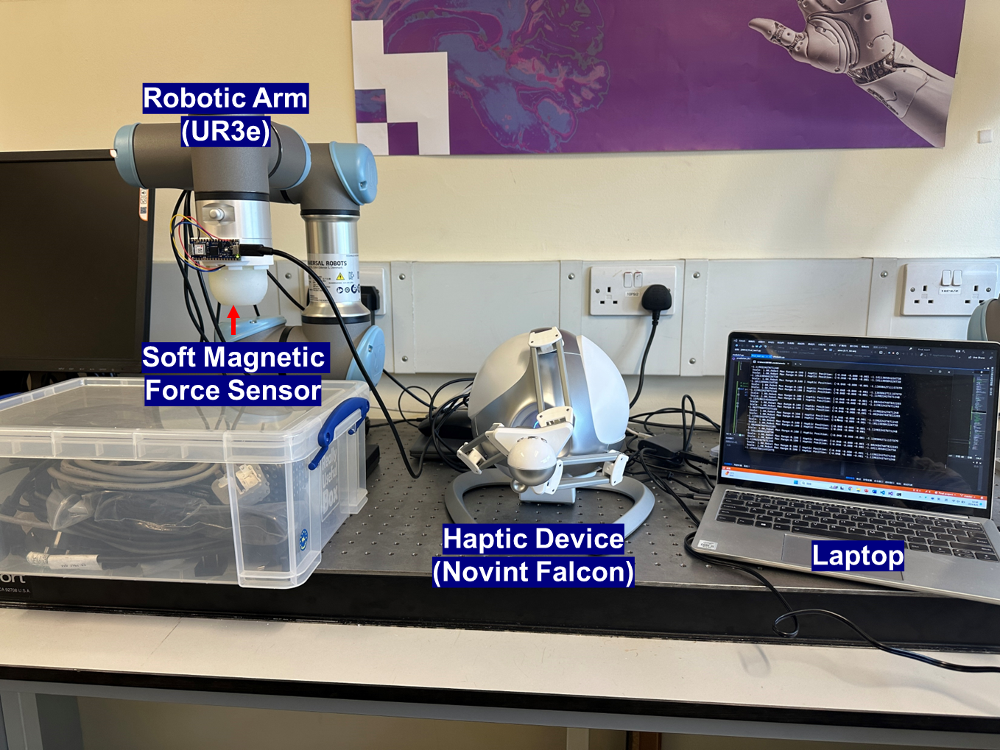

# Haptic environment development for biomedical application SN:23047130

## Introduction
This program is mainly used to implement interaction and haptic feedback between the Novint Falcon haptic device and the robotic arm. It is done by adding a soft Hall effect based force sensor to the robotic arm, thus transmitting the force sensed from the sensor to the haptic device (Z-axis only). 
The detailed information about the parameters of the haptic device can be obtained from this website: https://delfthapticslab.nl/device/novint-falcon/

## Library needed
The program is based on python 3.11 and is written on Visual Studio 2019. The following libraries are required in this program:
- pyserial
- keras
- math3d
- keyboard

Also `requirement.txt` file has provided.

## Arduino programe
This project used Adafruit MLX90393 3-axis hall sensor and Arduino Nano to make a soft magnetic force sensor. The sensor detects the position of the magnet on the silicone. When force is applied to this sensor, the silicone deforms, which brings the magnet closer to the sensor with changes in the magnetic field. The program of arduino is `adafruit_i2c.ino` which is placed in the `i2c_hallsensor` Folder. Please verify and upload to arduino board first. The Gain was set 2x in this case.

## Machine Learning Part
All the dataset which are original and processed have place in the `data_collection_2(Z)` Folder. The jupyter notebook files `Z_test.ipynb` shows the result of MLP and Linear model. And `Cross_validation.ipynb` shows the cross validation result. The best MLP model in the training has saved as `Z_best_model.h5`. More information about the files can be found in the readme file in the Folder.

The result of the machine learning section compares the performance of MLP and linear regression on this sensor. By comparing the MAE, it is proved that MLP performs better than linear regression for this task. The results are shown in the figure below.

## How to run
First, connect the robotic arm, the haptic device, and the pressure sensor interface to the computer. Then, for the haptic device, you need to download its driver (SDK), which can be downloaded from Force Dimension's official website: https://www.forcedimension.com/software/sdk. 

After the download and installation are completed, you can find two more programs on the desktop, which are Haptic Init and Haptic Desk. Due to the problem of the device, before running the code, you need to open the Haptic Desk program and move the handle back and forth according to the requirements to complete the initialization. 

Then, put the `URobotic` folder into your python environment, this is the library needed for the robotic arm control of UR3e.

After completing these settings, use Visual Studio 2019 to open and run `final_test1.sln` in `final_test1` folder

## During the Running
The program has implemented real-time control between the haptic device and the robotic arm. And can be operated by keyboard input:
- Keyboard ‘r’: The robot arm will move to the start position
- Keyboard ‘c’: The haptic device will move to the center
- Keyboard ‘z’: Decreasing the maximum moving range of the robotic arm. (Min: 0.05m)
- Keyboard ‘x’: Increasing the maximum moving range of the robotic arm. (Max: 0.3m)
- Keyboard ‘q’: Exit the running loop and turn off the haptic device. Also move the robotic arm back to the initial position.

### Note
Additionally, to improve the user experience, damping forces were added to the haptic, which can be adjusted by modifying the variables `damping_coefficient_translation` and `damping_coefficient_ rotation` to make adjustments.
At the same time, the size of the force feedback function can be modified by adjusting the specific coefficient in the variable `Z_force` (currently 0.5)
